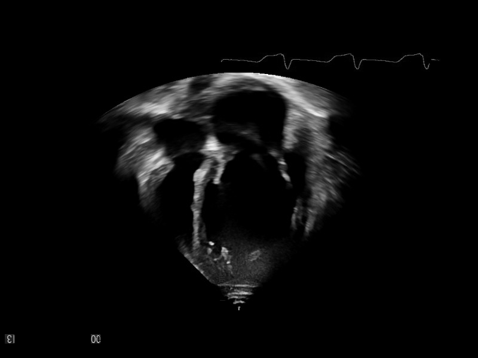
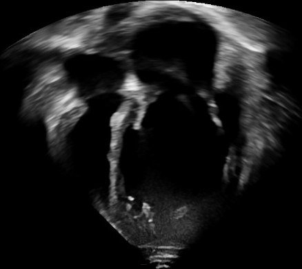

# Overview
This repo uses the same framework as **[MyFramework](https://www.kaggle.com/datasets/xiaoweixumedicalai/cardiacudc-dataset)**. The modifications are new  **[Dataset Registers](https://www.kaggle.com/datasets/xiaoweixumedicalai/cardiacudc-dataset)**, **[Mapper](https://www.kaggle.com/datasets/xiaoweixumedicalai/cardiacudc-dataset)**, **[Evaluator](https://www.kaggle.com/datasets/xiaoweixumedicalai/cardiacudc-dataset)**, and correspoind several Model implementations.

All experiments are based on the **[CardiacUDC](https://www.kaggle.com/datasets/xiaoweixumedicalai/cardiacudc-dataset)** dataset. 

We plan to first run LGRNet (a supervised Non-autoregressive small-model) on the CardiacUDC. After that, we plan to validate several novel designs including "Hybrid Temporal Sampling (HTS)", "Self-supervised Temporal Local-to-Global Self-Distillation (LGSD)", "box and SAM2 (BOX-SAM2)", "AutoRegressive Segmentation beats Unet (AR-SEG)".  

You can click links in each part to check the corresponding implementation.

| Model| FLOPS | #PARAMS | Dice | mIou | $\text{log}^1$ | ckpt | prediction video |
| :----: | :----: | :----: | :----: | :----: | :----: | :----: | :----: |
| BASIC | NAN | NAN | NAN | NAN | [log](https://drive.google.com/file/d/1wdVMWMknSlURaBROWbMax4iS9V1Tbn9-/view?usp=sharing) |[ckpt](https://drive.google.com/file/d/1D4YAIfFCCQIsDfKgSCr9tCw7vDAgqf76/view?usp=sharing) | [mask predictions](https://drive.google.com/file/d/1V8CDMC87o7t4eyts4BVEwflDUrFpAOVX/view?usp=sharing)
| +HTS | NAN | NAN | NAN | NAN | [log](https://drive.google.com/file/d/1wdVMWMknSlURaBROWbMax4iS9V1Tbn9-/view?usp=sharing) |[ckpt](https://drive.google.com/file/d/1D4YAIfFCCQIsDfKgSCr9tCw7vDAgqf76/view?usp=sharing) | [mask predictions](https://drive.google.com/file/d/1V8CDMC87o7t4eyts4BVEwflDUrFpAOVX/view?usp=sharing)
| +LGSD | NAN | NAN | NAN | NAN | [log](https://drive.google.com/file/d/1wdVMWMknSlURaBROWbMax4iS9V1Tbn9-/view?usp=sharing) |[ckpt](https://drive.google.com/file/d/1D4YAIfFCCQIsDfKgSCr9tCw7vDAgqf76/view?usp=sharing) | [mask predictions](https://drive.google.com/file/d/1V8CDMC87o7t4eyts4BVEwflDUrFpAOVX/view?usp=sharing)
| BOX-SAM2 | NAN | NAN | NAN | NAN| [log](https://drive.google.com/file/d/1wdVMWMknSlURaBROWbMax4iS9V1Tbn9-/view?usp=sharing) |[ckpt](https://drive.google.com/file/d/1D4YAIfFCCQIsDfKgSCr9tCw7vDAgqf76/view?usp=sharing) | [mask predictions](https://drive.google.com/file/d/1V8CDMC87o7t4eyts4BVEwflDUrFpAOVX/view?usp=sharing)
| AR-SEG | NAN | NAN | NAN | NAN | [log](https://drive.google.com/file/d/1wdVMWMknSlURaBROWbMax4iS9V1Tbn9-/view?usp=sharing) |[ckpt](https://drive.google.com/file/d/1D4YAIfFCCQIsDfKgSCr9tCw7vDAgqf76/view?usp=sharing) | [mask predictions](https://drive.google.com/file/d/1V8CDMC87o7t4eyts4BVEwflDUrFpAOVX/view?usp=sharing)

###### 1: The log is colored, so you need to use the vscode ANSI extention to view the log file.

## Data Curation
### Dataset Statistics
CardiacUDC has 4 classes (LF, RF, LV, RV). The videos come from 6 sites, each site uses different ultrasound device. There are a total of 284 annotated videos and 70 un-annotated videos. Each video has an average of 107 frames. Each annotated video has an average of 6 frames annotated.
A total of 

### Background Removal
In each video, large amounts of area are trivial background region. These region will cause additional computation. 
Specifically, we use an **[automatic low-level method](https://github.com/bio-mlhui/LGRNet/blob/main/models/encoder/ops/modules/frame_query_ss2d.py#L531)** to remove the background and ighlight the central fanshaped region.

 

### Train/Test Split
Since the videos are sparsely annotated, we build a benchmark where each test sample is a video clip of 11 frames and its 6th frame is annotated. We only compute Dice and IoU on the 6th frame.

Each train sample is a video clip of 7 frames. For a video with N annotated frames and M total frames, we can generate N supervised samples and M unsupervised samples. 

## BASIC: Cardiac Video Segmentation with LGRNet
We first start with the most common one. The BASIC model has three parts: multi-scale backbone, multi-scale encoder, query-based decoder. 
### Multiscale Backbone
Multi-scale information is vital to Segmentation. We use the Metaformer model, which maps $V\in R^{3\times T \times H\times W}$ to $4\times$, $8\times$, $16\times$, $32\times$ feature maps. 

$\textbf{My understainding to Convolution, Attention, Mamba.}$ Metaformer has 5 stages. The 1st stage is patch embedding, which is the same to ViT. The 2nd and 3rd stages are convolution. The 4th and 5th stages are attention. Why the authors choose this design?

Image information are redundant in surrounding pixels, especially in larger scales. It is not necessary to token-mix all tokens in the image during early stages. (Why? Convolution, Attention, and Mamba are different token-mixers, which provide different views for interacting a set of tokens. If the input tokens each contain different information, then the interaction will be effective. This is why in NLP, the notion of "multi-scale" is not popular. Each word is a sufficiently highly-abstracted meaning, not like low-level pixels. To make token-mixing effective, it is necessay to let each token contain different information. ) (Why Convolution is used to token-mix same-information tokens? Different from Attention and Mamba which are $\textbf{in-context}$ token-mixers, Conlution is context-free. All these token-mixers can be thought as "each output token is a linear combination of input tokens". However, the linear combination weights is fixed for convolution, and dynamic for Attention and Mamba. If the weights are dynamic and predicted from input tokens, the token mixer will be able to in-context learning. You can read more details "Preliminary of Selective State Space Model" in Section 2.2 of my LGRNet paper. I wrote all parts of the LGRNet paper.)

After two downsampling layers, the $16\times$ tokens have aggregate some higher-level information, we can use in-context token-mixers to interact these tokens.

### Multiscale Encoder: [h8w8 h16w16 h32w32] -> [h8w8 h16w16 h32w32]
Although the backbone outputs multi-scale features, it seems attractive and reasonable to token-mix tokens from different scales. Deformable Attention is a token-mixer where each input has scale-specific information. Inside **[DeformAttn](https://github.com/bio-mlhui/LGRNet/blob/main/models/encoder/ops/modules/frame_query_ss2d.py#L531)**, we use linear layer to query the position and dynamic weight of each attened token (c -> 1 + 4: weight + position). The output token is the linear combination of features of attened tokens.

### FPN: [h4 w4], [h8 w8] -> [h4 w4]
The information has interacted many times for the 8,16,32 scales. However, the 4-scale only has low-level information. To propogate the high-level information to the 4-scale, a simple **[FPN](https://github.com/bio-mlhui/LGRNet/blob/main/models/encoder/ops/modules/frame_query_ss2d.py#L531)** is used to fuse the 8-scale and 4-scale features.

### Mask2former Decoder: [n], [h8w8 h16w16 h32w32] -> [n]
The decoder is just a set of cross-self-ffn layers. The Mask2Former use masked cross attention to improve convergence.
$\textbf{FFN layer.}$ Most model parameters come from the FFN layer, which is composed of two fully-connected layers. The hidden dim is often set to the 4x of the input dimension. A explanation of why doing this (c->4c, 4c->c) is viewing the first transformation as "question answer" and second transformation as "information aggregation". The model asks a number of 4c questions in form of dot-product in the c-space (N c, c 4c -> N 4c), and uses the learned aggregation matrix to output the final representation for each output token (N 4c, 4c c -> N c). This interpretation comes from **[3Blue1Brown](https://www.youtube.com/watch?v=wjZofJX0v4M)**

### Mask Head and Class Head: [n c], [c K] -> n K; [n c], [c D], [D H W] -> [n H W]

### Bipartie Matching
I remeber it took a lot of time to fully understand the code implementation of "Bipart Matching loss" in the **[Referformer](https://www.youtube.com/watch?v=wjZofJX0v4M)**. In my code, I implement all the bapartite matching loss by myself, instead of using the DETR or Mask2Former implementation.

## Hybrid Temporal Sampling during Training
This idea comes from **[HTML](https://github.com/bio-mlhui/LGRNet/blob/main/models/encoder/ops/modules/frame_query_ss2d.py#L531)**. For example we want to sample a traininig clip of 7 frames based on the 15th frame of one video, a naive method is to build the training sample using [12,13,14, 15, 16,17,18]th fraems. However, if the training sample is not continuous such as [1, 5, 13, 15, 20, 40, 100] and we randomly sample frames at different intervals during the whole training process, the model can learn to "link"/"register" same region at different frames. The code is at **[Sample Interval](https://github.com/bio-mlhui/LGRNet/blob/main/models/encoder/ops/modules/frame_query_ss2d.py#L531)**

## Semi-supervised Cardiac Video Segmentation
Since there are many unlabeled frames in the dataset, I am wondering using the unsupervised signal to update the model. This idea comes from DINO, where each training image is cropped to 2 bigger crops and 9 smaller crops. 11 crops are input to the ViT. And we get 11 [CLS] tokens after the ViT layers. The Self-Distillation loss is to treat the bigger crop as gt probability distribution and smaller crop as predicted distribution, and uses the cross entropy to compute a total of 18 loss values. This loss can train the model to learn the 'local-to-global' correspondance in a self-supervised manner.

## Cardiac Video Segmentation == Box Prediction + Box-Promptable SAM2 Segmentation
Since each cardiac part is a continuous instance (not the scattered region such as sky, grass), we can decompose the video segmentation into Box Prediction and use the predicted boxes as SAM2 prompts to generate video segmentation

### 

## Decoder-only AutoRegressive Segmentation beats Unet, Segformer, and Mask2Former for Medical Image Segmentation.

### Related Works
There are many works using Unet and Transofmer for Segmentation taks, such as Unet, Mask2fomer. However, these models can not be intergrated into the modern LLM regime with a focus of **[Next-token Prediction is all you need](https://arxiv.org/abs/2409.18869)**. 

Several auto-regressive segmentation 

### Proposed Method
Since I am doing LLM, where most researchers adopts the same regime of "Auto-regressive Next-token prediction", I am wondering if the "next-token prediction" can be effective in the Cardiac Video Segmentation. 

### Experiments
We aim to use the same amouts of parameters

### Limitations
It is more fair to use the same amount of data and model capacity when comparing to Unet and Mask2former. LLaVA
### Tokenization

### [SEG] token

